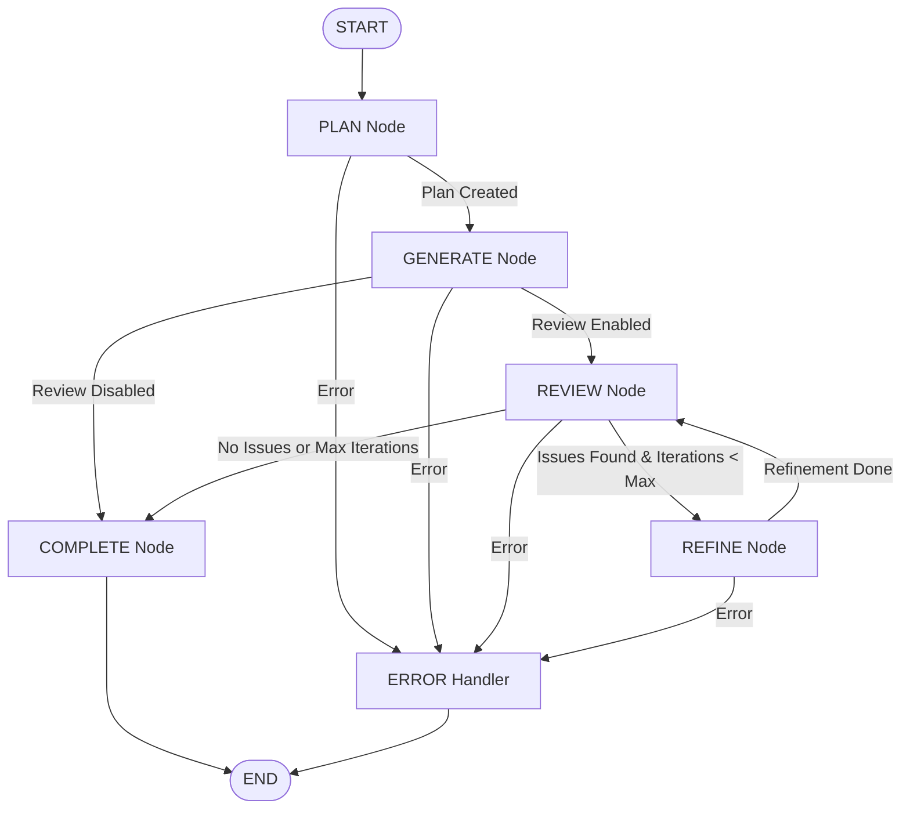
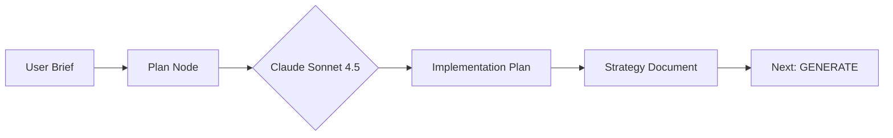
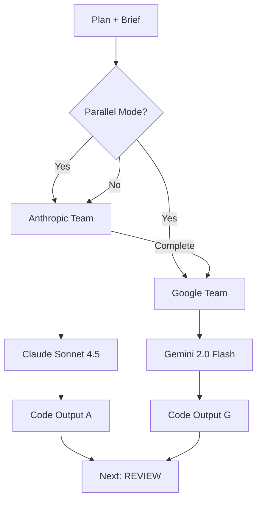
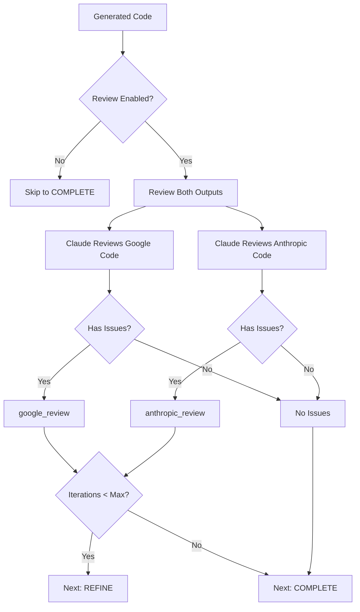
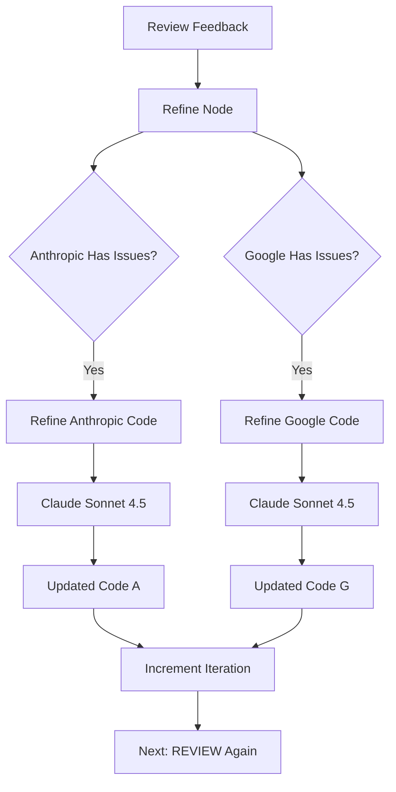
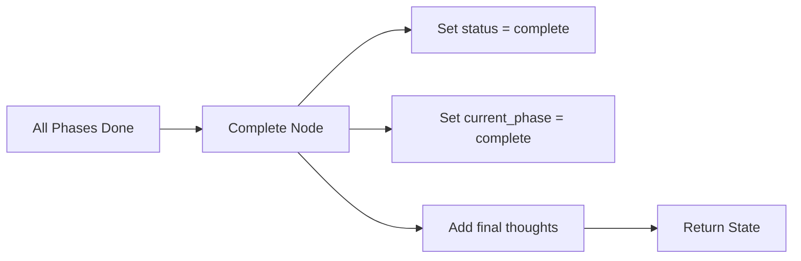
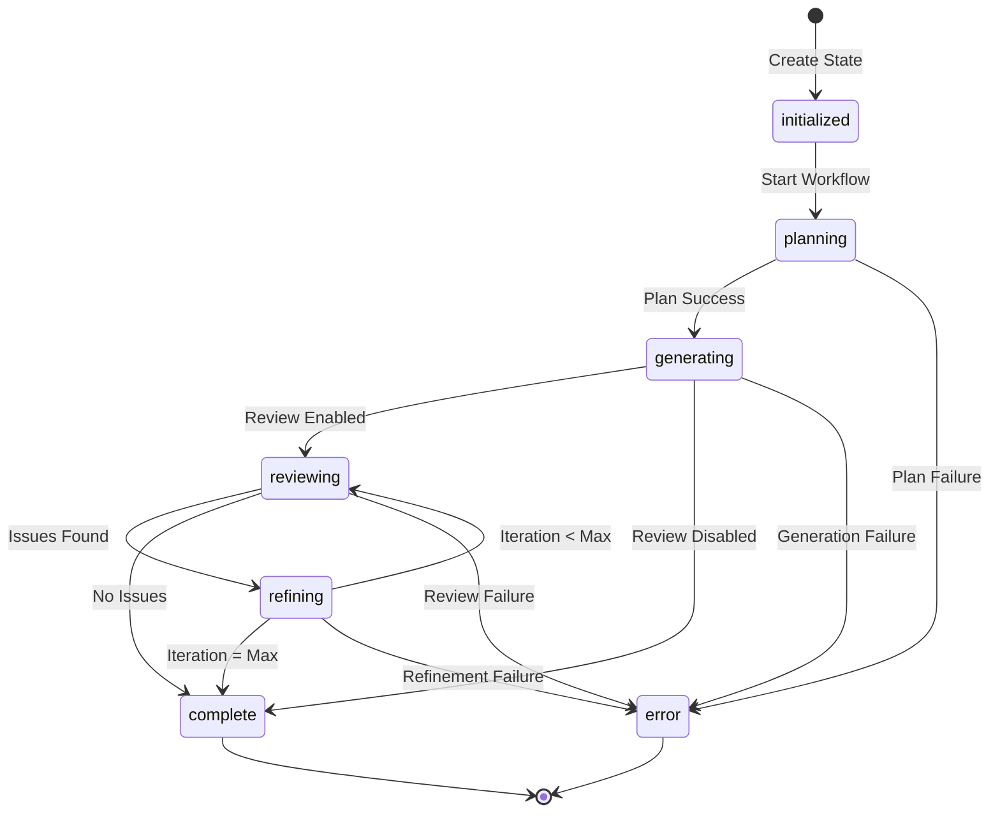
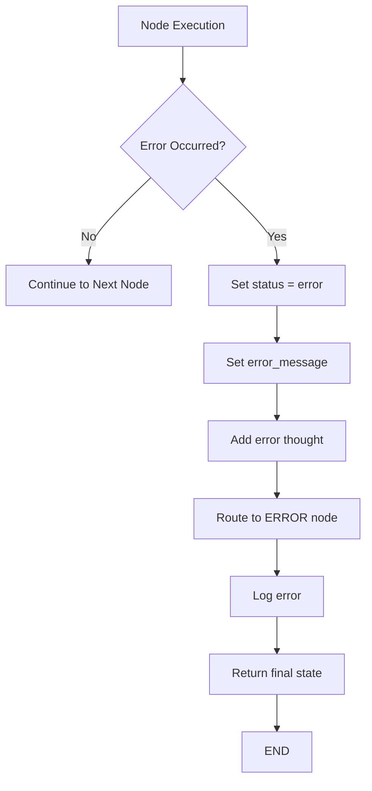

# LangGraph Orchestration Workflow - Visual Diagram

## High-Level Flow



## Detailed Phase Breakdown

### Phase 1: PLAN


**Outputs:**
- `plan`: Detailed implementation strategy
- `implementation_strategy`: Technical approach
- `thoughts`: Planning reasoning

---

### Phase 2: GENERATE (Parallel Mode)


**Outputs:**
- `anthropic_output`: Code from Claude
- `google_output`: Code from Gemini
- Each includes: code, model_used, token_count, error

---

### Phase 3: REVIEW


**Review Criteria:**
- Correctness
- Best practices
- Type safety
- Error handling
- Code quality
- Performance

**Outputs:**
- `anthropic_review`: ReviewResult with issues/suggestions
- `google_review`: ReviewResult with issues/suggestions
- `needs_refinement`: Boolean flag

---

### Phase 4: REFINE (Conditional)


**Refinement Loop:**
- Addresses specific issues from review
- Updates code in-place
- Increments iteration counter
- Goes back to REVIEW phase
- Max iterations prevents infinite loops

---

### Phase 5: COMPLETE


**Final State Contains:**
- All generated code
- All reviews
- Complete thought stream
- Iteration count
- Status and phase info

---

## State Flow Diagram



---

## Conditional Edge Logic

### after PLAN
```python
if state["status"] == "error":
    return "error"
if not state["plan"]:
    return "error"
return "generate"
```

### after GENERATE
```python
if state["status"] == "error":
    return "error"
if not (anthropic_ok or google_ok):
    return "error"
if state["enable_review"]:
    return "review"
return "complete"
```

### after REVIEW
```python
if state["status"] == "error":
    return "error"
if not state["needs_refinement"]:
    return "complete"
if state["refinement_iteration"] >= state["max_refinement_iterations"]:
    return "complete"
return "refine"
```

### after REFINE
```python
if state["status"] == "error":
    return "error"
if state["refinement_iteration"] >= state["max_refinement_iterations"]:
    return "complete"
return "review"
```

---

## Data Flow Example

### Input
```json
{
  "brief": "Create a counter component",
  "framework": "react",
  "config": "BALANCED_CONFIG"
}
```

### After PLAN
```json
{
  "status": "planning",
  "plan": "1. Create state with useState...",
  "thoughts": [{"text": "Starting planning...", "source": "planner"}]
}
```

### After GENERATE
```json
{
  "status": "generating",
  "anthropic_output": {
    "code": "import React...",
    "model_used": "claude-sonnet-4-5-20250929",
    "token_count": 523
  },
  "google_output": {
    "code": "import React...",
    "model_used": "gemini-2.0-flash-exp",
    "token_count": 489
  }
}
```

### After REVIEW
```json
{
  "status": "reviewing",
  "anthropic_review": {
    "has_issues": true,
    "issues": ["Missing prop validation"],
    "confidence": 0.85
  },
  "needs_refinement": true
}
```

### After REFINE
```json
{
  "status": "refining",
  "refinement_iteration": 1,
  "anthropic_output": {
    "code": "import React...\ninterface Props {...}",
    "token_count": 567
  }
}
```

### Final Output
```json
{
  "status": "complete",
  "current_phase": "complete",
  "refinement_iteration": 1,
  "anthropic_output": {...},
  "google_output": {...},
  "thoughts": [...all thoughts from entire workflow...]
}
```

---

## Configuration Impact

| Config | PLAN | GENERATE | REVIEW | REFINE | Total Time |
|--------|------|----------|--------|--------|------------|
| FAST | ✅ | ✅ (parallel) | ❌ | ❌ | ~15s |
| BALANCED | ✅ | ✅ (parallel) | ✅ | ✅ (1x) | ~30s |
| THOROUGH | ✅ | ✅ (parallel) | ✅ | ✅ (2x) | ~45s |
| SEQUENTIAL | ✅ | ✅ (serial) | ✅ | ✅ (1x) | ~35s |
| DEBUG | ✅ | ✅ (serial) | ❌ | ❌ | ~20s |

---

## Error Handling Flow



**Error Recovery:**
- Partial success is possible (one model succeeds)
- Graceful degradation
- Detailed error messages
- Complete state preserved
- Can resume from checkpoint (if enabled)
